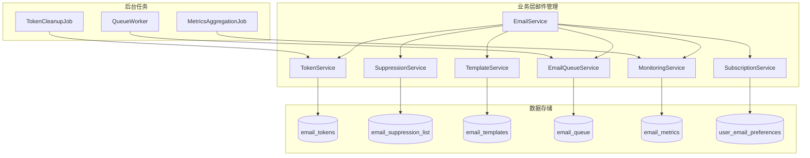

# 扩展设计文档 - 业务层邮件管理系统

本文档是 design.md 的扩展部分，描述业务层邮件管理系统的设计。

## 新增组件架构



## 1. Token 体系设计

### EmailToken 实体

```java
@Data
@Entity
@Table(name = "email_tokens")
public class EmailToken {
    
    @Id
    @GeneratedValue(strategy = GenerationType.IDENTITY)
    private Long id;
    
    /**
     * Token 哈希值（SHA-256）
     */
    @Column(nullable = false, unique = true, length = 64)
    private String tokenHash;
    
    /**
     * 用户 ID
     */
    @Column(nullable = false)
    private Long userId;
    
    /**
     * Token 用途
     */
    @Enumerated(EnumType.STRING)
    @Column(nullable = false, length = 20)
    private TokenPurpose purpose;
    
    /**
     * 过期时间
     */
    @Column(nullable = false)
    private LocalDateTime expiresAt;
    
    /**
     * 是否已使用
     */
    @Column(nullable = false)
    private Boolean used = false;
    
    /**
     * 使用时间
     */
    private LocalDateTime usedAt;
    
    /**
     * 创建时间
     */
    @Column(nullable = false)
    private LocalDateTime createdAt;
    
    @Index(name = "idx_user_purpose")
    @Index(name = "idx_expires_at")
}

enum TokenPurpose {
    EMAIL_VERIFICATION,  // 邮箱验证
    PASSWORD_RESET       // 密码重置
}
```

### TokenService 接口

```java
@Service
public class TokenService {
    
    private final EmailTokenRepository tokenRepository;
    private final SecureRandom secureRandom = new SecureRandom();
    
    /**
     * 生成并保存 Token
     */
    public String generateToken(Long userId, TokenPurpose purpose) {
        // 生成 32 字节随机 Token
        byte[] tokenBytes = new byte[32];
        secureRandom.nextBytes(tokenBytes);
        String token = Base64.getUrlEncoder().withoutPadding()
                .encodeToString(tokenBytes);
        
        // 计算 SHA-256 哈希
        String tokenHash = DigestUtils.sha256Hex(token);
        
        // 设置过期时间
        LocalDateTime expiresAt = purpose == TokenPurpose.EMAIL_VERIFICATION
                ? LocalDateTime.now().plusHours(24)
                : LocalDateTime.now().plusHours(1);
        
        // 作废同一用户同一用途的旧 Token
        tokenRepository.invalidateOldTokens(userId, purpose);
        
        // 保存新 Token
        EmailToken emailToken = new EmailToken();
        emailToken.setTokenHash(tokenHash);
        emailToken.setUserId(userId);
        emailToken.setPurpose(purpose);
        emailToken.setExpiresAt(expiresAt);
        emailToken.setCreatedAt(LocalDateTime.now());
        tokenRepository.save(emailToken);
        
        return token;
    }
    
    /**
     * 验证并使用 Token
     */
    public TokenValidationResult validateAndUseToken(String token, TokenPurpose purpose) {
        String tokenHash = DigestUtils.sha256Hex(token);
        
        Optional<EmailToken> tokenOpt = tokenRepository
                .findByTokenHashAndPurpose(tokenHash, purpose);
        
        if (tokenOpt.isEmpty()) {
            return TokenValidationResult.invalid("Token 不存在或已失效");
        }
        
        EmailToken emailToken = tokenOpt.get();
        
        // 检查是否已使用
        if (emailToken.getUsed()) {
            return TokenValidationResult.invalid("Token 已被使用");
        }
        
        // 检查是否过期
        if (LocalDateTime.now().isAfter(emailToken.getExpiresAt())) {
            return TokenValidationResult.invalid("Token 已过期");
        }
        
        // 标记为已使用
        emailToken.setUsed(true);
        emailToken.setUsedAt(LocalDateTime.now());
        tokenRepository.save(emailToken);
        
        return TokenValidationResult.success(emailToken.getUserId());
    }
    
    /**
     * 清理过期 Token（定时任务）
     */
    @Scheduled(cron = "0 0 2 * * ?") // 每天凌晨 2 点
    public void cleanupExpiredTokens() {
        LocalDateTime cutoffDate = LocalDateTime.now().minusDays(7);
        int deleted = tokenRepository.deleteExpiredTokens(cutoffDate);
        log.info("清理过期 Token: {} 条", deleted);
    }
}
```


## 2. 抑制列表设计

### EmailSuppression 实体

```java
@Data
@Entity
@Table(name = "email_suppression_list")
public class EmailSuppression {
    
    @Id
    @GeneratedValue(strategy = GenerationType.IDENTITY)
    private Long id;
    
    /**
     * 邮箱地址
     */
    @Column(nullable = false, unique = true, length = 255)
    private String email;
    
    /**
     * 抑制原因
     */
    @Enumerated(EnumType.STRING)
    @Column(nullable = false, length = 20)
    private SuppressionReason reason;
    
    /**
     * 抑制来源
     */
    @Column(nullable = false, length = 50)
    private String source;
    
    /**
     * 软退信计数（仅用于 SOFT_BOUNCE）
     */
    @Column(nullable = false)
    private Integer softBounceCount = 0;
    
    /**
     * 备注
     */
    @Column(length = 500)
    private String notes;
    
    /**
     * 创建时间
     */
    @Column(nullable = false)
    private LocalDateTime createdAt;
    
    /**
     * 最后更新时间
     */
    @Column(nullable = false)
    private LocalDateTime updatedAt;
    
    @Index(name = "idx_email")
    @Index(name = "idx_reason")
}

enum SuppressionReason {
    HARD_BOUNCE,    // 硬退信
    SOFT_BOUNCE,    // 软退信（超过阈值）
    COMPLAINT,      // 投诉
    MANUAL          // 手动添加
}
```

### SuppressionService 接口

```java
@Service
@Slf4j
public class SuppressionService {
    
    private final EmailSuppressionRepository suppressionRepository;
    private final int SOFT_BOUNCE_THRESHOLD = 3;
    
    /**
     * 检查邮箱是否在抑制列表中
     */
    public boolean isSuppressed(String email) {
        return suppressionRepository.existsByEmail(email.toLowerCase());
    }
    
    /**
     * 处理硬退信事件
     */
    public void handleHardBounce(String email, String source) {
        addToSuppressionList(email, SuppressionReason.HARD_BOUNCE, source,
                "硬退信：邮箱地址无效或不存在");
    }
    
    /**
     * 处理软退信事件
     */
    public void handleSoftBounce(String email, String source) {
        Optional<EmailSuppression> existing = suppressionRepository
                .findByEmail(email.toLowerCase());
        
        if (existing.isPresent()) {
            EmailSuppression suppression = existing.get();
            suppression.setSoftBounceCount(suppression.getSoftBounceCount() + 1);
            suppression.setUpdatedAt(LocalDateTime.now());
            
            if (suppression.getSoftBounceCount() >= SOFT_BOUNCE_THRESHOLD) {
                suppression.setReason(SuppressionReason.SOFT_BOUNCE);
                suppression.setNotes("软退信次数超过阈值: " + SOFT_BOUNCE_THRESHOLD);
                log.warn("邮箱 {} 软退信次数达到阈值，加入抑制列表", email);
            }
            
            suppressionRepository.save(suppression);
        } else {
            // 首次软退信，记录但不抑制
            EmailSuppression suppression = new EmailSuppression();
            suppression.setEmail(email.toLowerCase());
            suppression.setReason(SuppressionReason.SOFT_BOUNCE);
            suppression.setSource(source);
            suppression.setSoftBounceCount(1);
            suppression.setNotes("首次软退信，暂不抑制");
            suppression.setCreatedAt(LocalDateTime.now());
            suppression.setUpdatedAt(LocalDateTime.now());
            suppressionRepository.save(suppression);
        }
    }
    
    /**
     * 处理投诉事件
     */
    public void handleComplaint(String email, String source) {
        addToSuppressionList(email, SuppressionReason.COMPLAINT, source,
                "用户投诉：将邮件标记为垃圾邮件");
    }
    
    /**
     * 添加到抑制列表
     */
    private void addToSuppressionList(String email, SuppressionReason reason,
                                       String source, String notes) {
        Optional<EmailSuppression> existing = suppressionRepository
                .findByEmail(email.toLowerCase());
        
        if (existing.isPresent()) {
            EmailSuppression suppression = existing.get();
            suppression.setReason(reason);
            suppression.setSource(source);
            suppression.setNotes(notes);
            suppression.setUpdatedAt(LocalDateTime.now());
            suppressionRepository.save(suppression);
            log.info("更新抑制列表: email={}, reason={}", email, reason);
        } else {
            EmailSuppression suppression = new EmailSuppression();
            suppression.setEmail(email.toLowerCase());
            suppression.setReason(reason);
            suppression.setSource(source);
            suppression.setNotes(notes);
            suppression.setCreatedAt(LocalDateTime.now());
            suppression.setUpdatedAt(LocalDateTime.now());
            suppressionRepository.save(suppression);
            log.info("添加到抑制列表: email={}, reason={}", email, reason);
        }
    }
    
    /**
     * 手动移除抑制
     */
    public void removeFromSuppressionList(String email, String adminUser) {
        suppressionRepository.deleteByEmail(email.toLowerCase());
        log.info("从抑制列表移除: email={}, admin={}", email, adminUser);
    }
    
    /**
     * 查询抑制列表
     */
    public Page<EmailSuppression> querySuppressionList(
            SuppressionReason reason, Pageable pageable) {
        if (reason != null) {
            return suppressionRepository.findByReason(reason, pageable);
        }
        return suppressionRepository.findAll(pageable);
    }
}
```


## 3. AWS SES 事件处理

### SNS Webhook 接收器

```java
@RestController
@RequestMapping("/api/webhooks/ses")
@Slf4j
public class SesWebhookController {
    
    private final SuppressionService suppressionService;
    private final EmailAuditLogService auditLogService;
    
    /**
     * 接收 AWS SES 事件通知
     */
    @PostMapping("/events")
    public ResponseEntity<Void> handleSesEvent(@RequestBody String payload) {
        try {
            JSONObject json = new JSONObject(payload);
            
            // 验证 SNS 消息签名（生产环境必须）
            if (!verifySnsSignature(json)) {
                log.warn("SNS 消息签名验证失败");
                return ResponseEntity.status(HttpStatus.UNAUTHORIZED).build();
            }
            
            // 处理订阅确认
            if ("SubscriptionConfirmation".equals(json.getString("Type"))) {
                confirmSubscription(json.getString("SubscribeURL"));
                return ResponseEntity.ok().build();
            }
            
            // 处理事件通知
            if ("Notification".equals(json.getString("Type"))) {
                String message = json.getString("Message");
                JSONObject event = new JSONObject(message);
                
                String eventType = event.getString("eventType");
                String messageId = event.getJSONObject("mail")
                        .getString("messageId");
                
                switch (eventType) {
                    case "Bounce":
                        handleBounceEvent(event, messageId);
                        break;
                    case "Complaint":
                        handleComplaintEvent(event, messageId);
                        break;
                    case "Delivery":
                        handleDeliveryEvent(event, messageId);
                        break;
                    default:
                        log.info("未处理的事件类型: {}", eventType);
                }
            }
            
            return ResponseEntity.ok().build();
            
        } catch (Exception e) {
            log.error("处理 SES 事件失败", e);
            return ResponseEntity.status(HttpStatus.INTERNAL_SERVER_ERROR).build();
        }
    }
    
    private void handleBounceEvent(JSONObject event, String messageId) {
        JSONObject bounce = event.getJSONObject("bounce");
        String bounceType = bounce.getString("bounceType");
        JSONArray recipients = bounce.getJSONArray("bouncedRecipients");
        
        for (int i = 0; i < recipients.length(); i++) {
            String email = recipients.getJSONObject(i)
                    .getString("emailAddress");
            
            if ("Permanent".equals(bounceType)) {
                suppressionService.handleHardBounce(email, "AWS_SES");
            } else if ("Transient".equals(bounceType)) {
                suppressionService.handleSoftBounce(email, "AWS_SES");
            }
            
            // 更新审计日志
            auditLogService.updateBounceStatus(messageId, email, bounceType);
        }
        
        log.info("处理退信事件: messageId={}, type={}, count={}",
                messageId, bounceType, recipients.length());
    }
    
    private void handleComplaintEvent(JSONObject event, String messageId) {
        JSONObject complaint = event.getJSONObject("complaint");
        JSONArray recipients = complaint.getJSONArray("complainedRecipients");
        
        for (int i = 0; i < recipients.length(); i++) {
            String email = recipients.getJSONObject(i)
                    .getString("emailAddress");
            
            suppressionService.handleComplaint(email, "AWS_SES");
            
            // 更新审计日志
            auditLogService.updateComplaintStatus(messageId, email);
        }
        
        log.warn("处理投诉事件: messageId={}, count={}",
                messageId, recipients.length());
    }
    
    private void handleDeliveryEvent(JSONObject event, String messageId) {
        // 更新审计日志为已送达
        auditLogService.updateDeliveryStatus(messageId);
        log.debug("邮件已送达: messageId={}", messageId);
    }
}
```


## 4. 邮件模板管理系统

### EmailTemplate 实体

```java
@Data
@Entity
@Table(name = "email_templates")
public class EmailTemplate {
    
    @Id
    @GeneratedValue(strategy = GenerationType.IDENTITY)
    private Long id;
    
    /**
     * 模板代码（唯一标识）
     */
    @Column(nullable = false, unique = true, length = 50)
    private String code;
    
    /**
     * 模板名称
     */
    @Column(nullable = false, length = 100)
    private String name;
    
    /**
     * 语言代码
     */
    @Column(nullable = false, length = 10)
    private String language;
    
    /**
     * 邮件主题模板
     */
    @Column(nullable = false, length = 200)
    private String subject;
    
    /**
     * HTML 内容模板
     */
    @Column(nullable = false, columnDefinition = "TEXT")
    private String htmlContent;
    
    /**
     * 纯文本内容模板
     */
    @Column(columnDefinition = "TEXT")
    private String textContent;
    
    /**
     * 模板变量说明（JSON 格式）
     */
    @Column(columnDefinition = "TEXT")
    private String variables;
    
    /**
     * 版本号
     */
    @Column(nullable = false)
    private Integer version = 1;
    
    /**
     * 是否启用
     */
    @Column(nullable = false)
    private Boolean enabled = true;
    
    /**
     * 创建时间
     */
    @Column(nullable = false)
    private LocalDateTime createdAt;
    
    /**
     * 更新时间
     */
    @Column(nullable = false)
    private LocalDateTime updatedAt;
    
    @Index(name = "idx_code_language")
}
```

### TemplateService 接口

```java
@Service
@Slf4j
public class TemplateService {
    
    private final EmailTemplateRepository templateRepository;
    private final ConcurrentHashMap<String, EmailTemplate> templateCache 
            = new ConcurrentHashMap<>();
    
    /**
     * 渲染模板
     */
    public RenderedEmail renderTemplate(String templateCode, String language,
                                         Map<String, Object> variables) {
        // 获取模板
        EmailTemplate template = getTemplate(templateCode, language);
        
        if (template == null) {
            throw new BusinessException(ErrorCode.TEMPLATE_NOT_FOUND,
                    "模板不存在: " + templateCode);
        }
        
        // 渲染主题
        String subject = renderString(template.getSubject(), variables);
        
        // 渲染 HTML 内容
        String htmlContent = renderString(template.getHtmlContent(), variables);
        
        // 渲染纯文本内容
        String textContent = template.getTextContent() != null
                ? renderString(template.getTextContent(), variables)
                : null;
        
        return RenderedEmail.builder()
                .subject(subject)
                .htmlContent(htmlContent)
                .textContent(textContent)
                .build();
    }
    
    /**
     * 获取模板（带缓存）
     */
    private EmailTemplate getTemplate(String code, String language) {
        String cacheKey = code + "_" + language;
        
        return templateCache.computeIfAbsent(cacheKey, k -> {
            Optional<EmailTemplate> template = templateRepository
                    .findByCodeAndLanguageAndEnabled(code, language, true);
            
            if (template.isEmpty() && !"zh-CN".equals(language)) {
                // 回退到中文模板
                template = templateRepository
                        .findByCodeAndLanguageAndEnabled(code, "zh-CN", true);
            }
            
            return template.orElse(null);
        });
    }
    
    /**
     * 渲染字符串（简单变量替换）
     */
    private String renderString(String template, Map<String, Object> variables) {
        String result = template;
        
        for (Map.Entry<String, Object> entry : variables.entrySet()) {
            String placeholder = "${" + entry.getKey() + "}";
            String value = entry.getValue() != null 
                    ? entry.getValue().toString() 
                    : "";
            result = result.replace(placeholder, value);
        }
        
        return result;
    }
    
    /**
     * 清除缓存
     */
    @CacheEvict(allEntries = true)
    public void clearCache() {
        templateCache.clear();
        log.info("模板缓存已清除");
    }
    
    /**
     * 预览模板
     */
    public RenderedEmail previewTemplate(String templateCode, String language) {
        EmailTemplate template = getTemplate(templateCode, language);
        
        if (template == null) {
            throw new BusinessException(ErrorCode.TEMPLATE_NOT_FOUND);
        }
        
        // 使用示例数据
        Map<String, Object> sampleData = getSampleData(templateCode);
        
        return renderTemplate(templateCode, language, sampleData);
    }
    
    private Map<String, Object> getSampleData(String templateCode) {
        Map<String, Object> data = new HashMap<>();
        data.put("username", "张三");
        data.put("verificationCode", "123456");
        data.put("resetLink", "https://polaristools.online/reset?token=xxx");
        data.put("loginTime", "2024-01-15 10:30:00");
        data.put("ipAddress", "192.168.1.1");
        data.put("device", "Chrome on Windows");
        return data;
    }
}
```


## 5. 邮件发送队列系统

### EmailQueue 实体

```java
@Data
@Entity
@Table(name = "email_queue")
public class EmailQueue {
    
    @Id
    @GeneratedValue(strategy = GenerationType.IDENTITY)
    private Long id;
    
    /**
     * 收件人邮箱
     */
    @Column(nullable = false, length = 255)
    private String recipient;
    
    /**
     * 邮件主题
     */
    @Column(nullable = false, length = 500)
    private String subject;
    
    /**
     * HTML 内容
     */
    @Column(columnDefinition = "TEXT")
    private String htmlContent;
    
    /**
     * 纯文本内容
     */
    @Column(columnDefinition = "TEXT")
    private String textContent;
    
    /**
     * 邮件类型
     */
    @Column(nullable = false, length = 50)
    private String emailType;
    
    /**
     * 优先级
     */
    @Enumerated(EnumType.STRING)
    @Column(nullable = false, length = 10)
    private EmailPriority priority = EmailPriority.NORMAL;
    
    /**
     * 队列状态
     */
    @Enumerated(EnumType.STRING)
    @Column(nullable = false, length = 20)
    private QueueStatus status = QueueStatus.PENDING;
    
    /**
     * 重试次数
     */
    @Column(nullable = false)
    private Integer retryCount = 0;
    
    /**
     * 最大重试次数
     */
    @Column(nullable = false)
    private Integer maxRetries = 3;
    
    /**
     * 错误信息
     */
    @Column(length = 1000)
    private String errorMessage;
    
    /**
     * 计划发送时间
     */
    @Column(nullable = false)
    private LocalDateTime scheduledAt;
    
    /**
     * 实际发送时间
     */
    private LocalDateTime sentAt;
    
    /**
     * 创建时间
     */
    @Column(nullable = false)
    private LocalDateTime createdAt;
    
    @Index(name = "idx_status_priority")
    @Index(name = "idx_scheduled_at")
}

enum EmailPriority {
    HIGH,    // 高优先级（验证码、密码重置）
    NORMAL,  // 普通优先级（通知）
    LOW      // 低优先级（营销邮件）
}

enum QueueStatus {
    PENDING,     // 待发送
    PROCESSING,  // 发送中
    SENT,        // 已发送
    FAILED       // 发送失败
}
```

### EmailQueueService 接口

```java
@Service
@Slf4j
public class EmailQueueService {
    
    private final EmailQueueRepository queueRepository;
    private final SesEmailSender sesEmailSender;
    private final SuppressionService suppressionService;
    
    /**
     * 将邮件加入队列
     */
    public Long enqueue(SendEmailRequest request, EmailPriority priority) {
        // 检查抑制列表
        for (String recipient : request.getTo()) {
            if (suppressionService.isSuppressed(recipient)) {
                log.warn("邮箱在抑制列表中，拒绝加入队列: {}", recipient);
                throw new BusinessException(ErrorCode.EMAIL_SUPPRESSED,
                        "邮箱地址在抑制列表中: " + recipient);
            }
        }
        
        EmailQueue queueItem = new EmailQueue();
        queueItem.setRecipient(String.join(",", request.getTo()));
        queueItem.setSubject(request.getSubject());
        queueItem.setHtmlContent(request.getHtml());
        queueItem.setTextContent(request.getText());
        queueItem.setEmailType(determineEmailType(request.getSubject()));
        queueItem.setPriority(priority);
        queueItem.setScheduledAt(LocalDateTime.now());
        queueItem.setCreatedAt(LocalDateTime.now());
        
        queueRepository.save(queueItem);
        
        log.info("邮件已加入队列: id={}, recipient={}, priority={}",
                queueItem.getId(), queueItem.getRecipient(), priority);
        
        return queueItem.getId();
    }
    
    /**
     * 获取待发送的邮件（按优先级排序）
     */
    public List<EmailQueue> getPendingEmails(int limit) {
        return queueRepository.findPendingEmails(
                QueueStatus.PENDING,
                LocalDateTime.now(),
                PageRequest.of(0, limit,
                        Sort.by(Sort.Order.asc("priority"),
                                Sort.Order.asc("scheduledAt")))
        );
    }
    
    /**
     * 处理队列中的邮件
     */
    @Transactional
    public void processQueueItem(Long queueId) {
        Optional<EmailQueue> queueOpt = queueRepository.findById(queueId);
        
        if (queueOpt.isEmpty()) {
            log.warn("队列项不存在: id={}", queueId);
            return;
        }
        
        EmailQueue queueItem = queueOpt.get();
        
        // 更新状态为处理中
        queueItem.setStatus(QueueStatus.PROCESSING);
        queueRepository.save(queueItem);
        
        try {
            // 构建邮件请求
            EmailRequest emailRequest = EmailRequest.builder()
                    .to(Arrays.asList(queueItem.getRecipient().split(",")))
                    .subject(queueItem.getSubject())
                    .html(queueItem.getHtmlContent())
                    .text(queueItem.getTextContent())
                    .build();
            
            // 发送邮件
            SendEmailResult result = sesEmailSender.sendEmail(emailRequest);
            
            if (result.isSuccess()) {
                queueItem.setStatus(QueueStatus.SENT);
                queueItem.setSentAt(LocalDateTime.now());
                log.info("队列邮件发送成功: id={}, messageId={}",
                        queueId, result.getMessageId());
            } else {
                handleSendFailure(queueItem, result.getErrorMessage());
            }
            
        } catch (Exception e) {
            log.error("队列邮件发送异常: id={}", queueId, e);
            handleSendFailure(queueItem, e.getMessage());
        }
        
        queueRepository.save(queueItem);
    }
    
    private void handleSendFailure(EmailQueue queueItem, String errorMessage) {
        queueItem.setRetryCount(queueItem.getRetryCount() + 1);
        queueItem.setErrorMessage(errorMessage);
        
        if (queueItem.getRetryCount() >= queueItem.getMaxRetries()) {
            queueItem.setStatus(QueueStatus.FAILED);
            log.error("队列邮件发送失败，已达最大重试次数: id={}, retries={}",
                    queueItem.getId(), queueItem.getRetryCount());
        } else {
            queueItem.setStatus(QueueStatus.PENDING);
            // 指数退避：下次重试时间 = 当前时间 + 2^retryCount 分钟
            int delayMinutes = (int) Math.pow(2, queueItem.getRetryCount());
            queueItem.setScheduledAt(LocalDateTime.now().plusMinutes(delayMinutes));
            log.warn("队列邮件发送失败，将重试: id={}, retries={}, nextRetry={}",
                    queueItem.getId(), queueItem.getRetryCount(),
                    queueItem.getScheduledAt());
        }
    }
    
    private String determineEmailType(String subject) {
        if (subject.contains("验证")) return "VERIFICATION";
        if (subject.contains("密码")) return "PASSWORD_RESET";
        if (subject.contains("登录")) return "LOGIN_NOTIFICATION";
        return "GENERAL";
    }
}
```

### QueueWorker 后台任务

```java
@Component
@Slf4j
public class EmailQueueWorker {
    
    private final EmailQueueService queueService;
    private final ExecutorService executorService;
    
    @Value("${email.queue.worker-threads:5}")
    private int workerThreads;
    
    @Value("${email.queue.batch-size:10}")
    private int batchSize;
    
    public EmailQueueWorker(EmailQueueService queueService) {
        this.queueService = queueService;
        this.executorService = Executors.newFixedThreadPool(workerThreads);
    }
    
    /**
     * 定时处理队列（每 10 秒）
     */
    @Scheduled(fixedDelay = 10000)
    public void processQueue() {
        try {
            List<EmailQueue> pendingEmails = queueService
                    .getPendingEmails(batchSize);
            
            if (pendingEmails.isEmpty()) {
                return;
            }
            
            log.info("开始处理邮件队列: count={}", pendingEmails.size());
            
            List<CompletableFuture<Void>> futures = pendingEmails.stream()
                    .map(email -> CompletableFuture.runAsync(
                            () -> queueService.processQueueItem(email.getId()),
                            executorService
                    ))
                    .collect(Collectors.toList());
            
            // 等待所有任务完成
            CompletableFuture.allOf(futures.toArray(new CompletableFuture[0]))
                    .join();
            
            log.info("邮件队列处理完成: count={}", pendingEmails.size());
            
        } catch (Exception e) {
            log.error("处理邮件队列失败", e);
        }
    }
    
    @PreDestroy
    public void shutdown() {
        executorService.shutdown();
        try {
            if (!executorService.awaitTermination(60, TimeUnit.SECONDS)) {
                executorService.shutdownNow();
            }
        } catch (InterruptedException e) {
            executorService.shutdownNow();
        }
    }
}
```

