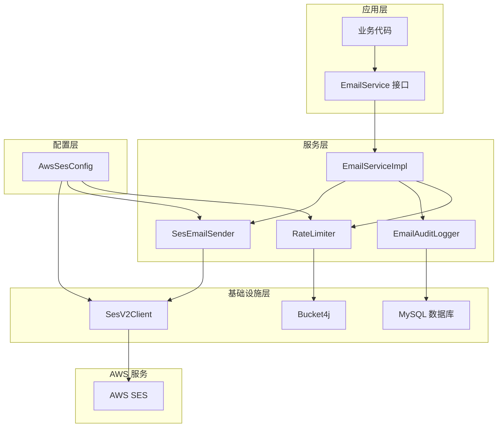
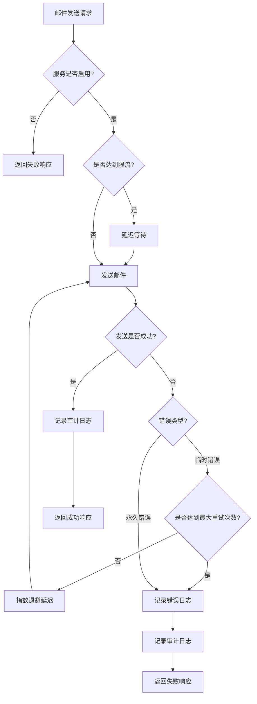

# 设计文档

## 概述

本设计文档描述了将 Polaris Tools 项目的邮箱服务从 Resend 迁移到 AWS SES (Simple Email Service) 的技术实现方案。设计目标是在保持现有接口不变的前提下，替换底层邮件发送实现，并增强系统的可靠性、可观测性和安全性。

**重要 - 架构对齐**: 本设计遵循 `backend-refactoring` 规范定义的插件化架构模式。EmailAuditLog 实体继承 `BaseEntity`，确保与其他模块（Tool、Category、Document 等）保持一致的架构风格。

### 设计原则

1. **向后兼容性**: 保持 `EmailService` 接口不变，确保业务代码无需修改
2. **可靠性优先**: 实现完善的错误处理和重试机制
3. **可观测性**: 提供详细的日志记录和审计追踪
4. **安全性**: 遵循最小权限原则，使用 IAM 角色管理权限
5. **可扩展性**: 支持限流保护，避免超出 AWS SES 配额
6. **架构一致性**: 遵循 backend-refactoring 插件化架构模式

### 技术选型

- **AWS SDK**: AWS SDK for Java 2.x (SESv2 API)
- **重试框架**: AWS SDK 内置的重试策略
- **限流实现**: Bucket4j (令牌桶算法)
- **数据库**: MySQL (审计日志存储)
- **测试框架**: JUnit 5 + jqwik (属性测试)

### 参考资料

- [AWS SES API v2 文档](https://docs.aws.amazon.com/sdk-for-java/latest/developer-guide/java_sesv2_code_examples.html)
- [AWS SDK for Java 2.x 重试策略](https://sdk.amazonaws.com/java/api/latest/software/amazon/awssdk/core/retry/backoff/BackoffStrategy.html)

## 架构

### 系统架构图



### 组件职责

1. **EmailService**: 邮件服务接口，定义所有邮件发送方法
2. **EmailServiceImpl**: 邮件服务实现类，协调各个组件完成邮件发送
3. **SesEmailSender**: AWS SES 邮件发送器，封装 AWS SDK 调用
4. **EmailAuditLogger**: 邮件审计日志记录器，记录所有邮件发送活动
5. **RateLimiter**: 限流器，控制邮件发送速率
6. **AwsSesConfig**: AWS SES 配置类，管理连接参数和客户端 Bean
7. **SesV2Client**: AWS SDK 提供的 SES 客户端

## 组件和接口

### 1. AwsSesConfig (配置类)

```java
@Data
@Configuration
@ConfigurationProperties(prefix = "aws.ses")
public class AwsSesConfig {
    
    /**
     * AWS 区域 (例如: us-east-1)
     */
    private String region = "us-east-1";
    
    /**
     * AWS 访问密钥 ID (建议使用环境变量或 IAM 角色)
     */
    private String accessKeyId;
    
    /**
     * AWS 秘密访问密钥 (建议使用环境变量或 IAM 角色)
     */
    private String secretAccessKey;
    
    /**
     * 发件人邮箱地址
     */
    private String fromEmail;
    
    /**
     * 是否启用邮件服务
     */
    private boolean enabled = true;
    
    /**
     * 配置集名称 (用于事件跟踪)
     */
    private String configurationSetName;
    
    /**
     * 重试配置
     */
    private RetryConfig retry = new RetryConfig();
    
    /**
     * 限流配置
     */
    private RateLimitConfig rateLimit = new RateLimitConfig();
    
    @Data
    public static class RetryConfig {
        /**
         * 最大重试次数
         */
        private int maxAttempts = 3;
        
        /**
         * 基础延迟时间 (毫秒)
         */
        private long baseDelayMillis = 1000;
        
        /**
         * 最大延迟时间 (毫秒)
         */
        private long maxDelayMillis = 20000;
    }
    
    @Data
    public static class RateLimitConfig {
        /**
         * 每秒最大邮件发送数
         */
        private int maxEmailsPerSecond = 10;
        
        /**
         * 每日最大邮件发送数
         */
        private int maxEmailsPerDay = 50000;
    }
    
    /**
     * 创建 SesV2Client Bean
     */
    @Bean
    public SesV2Client sesV2Client() {
        Region awsRegion = Region.of(region);
        
        SesV2ClientBuilder builder = SesV2Client.builder()
                .region(awsRegion);
        
        // 如果提供了访问密钥，使用静态凭证
        // 否则使用默认凭证链 (环境变量、IAM 角色等)
        if (accessKeyId != null && secretAccessKey != null) {
            AwsBasicCredentials credentials = AwsBasicCredentials.create(
                    accessKeyId, secretAccessKey);
            builder.credentialsProvider(StaticCredentialsProvider.create(credentials));
        }
        
        // 配置重试策略
        RetryPolicy retryPolicy = RetryPolicy.builder()
                .numRetries(retry.getMaxAttempts())
                .backoffStrategy(BackoffStrategy.defaultStrategy())
                .build();
        
        builder.overrideConfiguration(ClientOverrideConfiguration.builder()
                .retryPolicy(retryPolicy)
                .build());
        
        return builder.build();
    }
}
```

### 2. SesEmailSender (AWS SES 邮件发送器)

```java
@Slf4j
@Component
@RequiredArgsConstructor
public class SesEmailSender {
    
    private final SesV2Client sesV2Client;
    private final AwsSesConfig config;
    
    /**
     * 发送邮件
     */
    public SendEmailResult sendEmail(EmailRequest request) {
        try {
            // 构建目标地址
            Destination.Builder destinationBuilder = Destination.builder();
            
            if (request.getTo() != null && !request.getTo().isEmpty()) {
                destinationBuilder.toAddresses(request.getTo());
            }
            
            if (request.getCc() != null && !request.getCc().isEmpty()) {
                destinationBuilder.ccAddresses(request.getCc());
            }
            
            if (request.getBcc() != null && !request.getBcc().isEmpty()) {
                destinationBuilder.bccAddresses(request.getBcc());
            }
            
            Destination destination = destinationBuilder.build();
            
            // 构建邮件内容
            Content subject = Content.builder()
                    .data(request.getSubject())
                    .charset("UTF-8")
                    .build();
            
            Body.Builder bodyBuilder = Body.builder();
            
            if (request.getHtml() != null && !request.getHtml().isEmpty()) {
                Content htmlContent = Content.builder()
                        .data(request.getHtml())
                        .charset("UTF-8")
                        .build();
                bodyBuilder.html(htmlContent);
            }
            
            if (request.getText() != null && !request.getText().isEmpty()) {
                Content textContent = Content.builder()
                        .data(request.getText())
                        .charset("UTF-8")
                        .build();
                bodyBuilder.text(textContent);
            }
            
            Message message = Message.builder()
                    .subject(subject)
                    .body(bodyBuilder.build())
                    .build();
            
            EmailContent emailContent = EmailContent.builder()
                    .simple(message)
                    .build();
            
            // 构建发送请求
            SendEmailRequest.Builder requestBuilder = SendEmailRequest.builder()
                    .fromEmailAddress(config.getFromEmail())
                    .destination(destination)
                    .content(emailContent);
            
            // 设置回复地址
            if (request.getReplyTo() != null && !request.getReplyTo().isEmpty()) {
                requestBuilder.replyToAddresses(request.getReplyTo());
            }
            
            // 设置配置集
            if (config.getConfigurationSetName() != null) {
                requestBuilder.configurationSetName(config.getConfigurationSetName());
            }
            
            // 发送邮件
            long startTime = System.currentTimeMillis();
            software.amazon.awssdk.services.sesv2.model.SendEmailResponse response = 
                    sesV2Client.sendEmail(requestBuilder.build());
            long duration = System.currentTimeMillis() - startTime;
            
            log.info("邮件发送成功: messageId={}, to={}, subject={}, duration={}ms",
                    response.messageId(), request.getTo(), request.getSubject(), duration);
            
            return SendEmailResult.success(response.messageId());
            
        } catch (SesV2Exception e) {
            log.error("AWS SES 邮件发送失败: to={}, subject={}, error={}",
                    request.getTo(), request.getSubject(), e.awsErrorDetails().errorMessage(), e);
            
            return SendEmailResult.failure(
                    e.awsErrorDetails().errorCode(),
                    e.awsErrorDetails().errorMessage(),
                    isRetryable(e)
            );
        } catch (Exception e) {
            log.error("邮件发送异常: to={}, subject={}, error={}",
                    request.getTo(), request.getSubject(), e.getMessage(), e);
            
            return SendEmailResult.failure("UNKNOWN_ERROR", e.getMessage(), false);
        }
    }
    
    /**
     * 判断错误是否可重试
     */
    private boolean isRetryable(SesV2Exception e) {
        String errorCode = e.awsErrorDetails().errorCode();
        
        // 可重试的错误代码
        return "Throttling".equals(errorCode) ||
               "ServiceUnavailable".equals(errorCode) ||
               "InternalFailure".equals(errorCode) ||
               "RequestTimeout".equals(errorCode);
    }
}
```

### 3. EmailAuditLogger (邮件审计日志记录器)

```java
@Slf4j
@Component
@RequiredArgsConstructor
public class EmailAuditLogger {
    
    private final EmailAuditLogRepository repository;
    
    /**
     * 记录邮件发送审计日志
     */
    public void logEmailSent(EmailAuditLog auditLog) {
        try {
            repository.save(auditLog);
            log.debug("邮件审计日志已记录: id={}, to={}, status={}",
                    auditLog.getId(), auditLog.getRecipient(), auditLog.getStatus());
        } catch (Exception e) {
            log.error("记录邮件审计日志失败: to={}, error={}",
                    auditLog.getRecipient(), e.getMessage(), e);
            // 不抛出异常，避免影响邮件发送流程
        }
    }
    
    /**
     * 查询审计日志
     */
    public Page<EmailAuditLog> queryAuditLogs(EmailAuditLogQuery query, Pageable pageable) {
        return repository.findByQuery(query, pageable);
    }
}
```

### 4. RateLimiter (限流器)

```java
@Slf4j
@Component
public class EmailRateLimiter {
    
    private final Bucket perSecondBucket;
    private final Bucket perDayBucket;
    
    public EmailRateLimiter(AwsSesConfig config) {
        // 每秒限流桶
        Bandwidth perSecondLimit = Bandwidth.classic(
                config.getRateLimit().getMaxEmailsPerSecond(),
                Refill.intervally(
                        config.getRateLimit().getMaxEmailsPerSecond(),
                        Duration.ofSeconds(1)
                )
        );
        this.perSecondBucket = Bucket.builder()
                .addLimit(perSecondLimit)
                .build();
        
        // 每日限流桶
        Bandwidth perDayLimit = Bandwidth.classic(
                config.getRateLimit().getMaxEmailsPerDay(),
                Refill.intervally(
                        config.getRateLimit().getMaxEmailsPerDay(),
                        Duration.ofDays(1)
                )
        );
        this.perDayBucket = Bucket.builder()
                .addLimit(perDayLimit)
                .build();
    }
    
    /**
     * 尝试获取发送许可
     * 如果达到限流，会阻塞等待
     */
    public void acquirePermit() {
        try {
            // 等待每秒限流桶
            perSecondBucket.asBlocking().consume(1);
            
            // 等待每日限流桶
            perDayBucket.asBlocking().consume(1);
            
        } catch (InterruptedException e) {
            Thread.currentThread().interrupt();
            log.warn("限流等待被中断", e);
            throw new RuntimeException("限流等待被中断", e);
        }
    }
    
    /**
     * 尝试获取发送许可 (非阻塞)
     * 
     * @return 是否成功获取许可
     */
    public boolean tryAcquirePermit() {
        boolean perSecondAvailable = perSecondBucket.tryConsume(1);
        if (!perSecondAvailable) {
            log.warn("达到每秒邮件发送限制");
            return false;
        }
        
        boolean perDayAvailable = perDayBucket.tryConsume(1);
        if (!perDayAvailable) {
            log.warn("达到每日邮件发送限制");
            // 归还每秒限流桶的令牌
            perSecondBucket.addTokens(1);
            return false;
        }
        
        return true;
    }
}
```

### 5. EmailServiceImpl (邮件服务实现)

```java
@Slf4j
@Service
@RequiredArgsConstructor
public class EmailServiceImpl implements EmailService {
    
    private final SesEmailSender sesEmailSender;
    private final EmailAuditLogger auditLogger;
    private final EmailRateLimiter rateLimiter;
    private final AwsSesConfig config;
    
    @Override
    public SendEmailResponse sendEmail(SendEmailRequest request) {
        // 检查邮件服务是否启用
        if (!config.isEnabled()) {
            log.warn("邮件服务已禁用，跳过发送: subject={}", request.getSubject());
            return SendEmailResponse.builder()
                    .success(false)
                    .message("邮件服务已禁用")
                    .build();
        }
        
        // 限流控制
        rateLimiter.acquirePermit();
        
        // 创建审计日志
        EmailAuditLog auditLog = createAuditLog(request);
        
        try {
            // 转换请求对象
            EmailRequest emailRequest = convertToEmailRequest(request);
            
            // 发送邮件
            SendEmailResult result = sesEmailSender.sendEmail(emailRequest);
            
            // 更新审计日志
            if (result.isSuccess()) {
                auditLog.setStatus(EmailStatus.SENT);
                auditLog.setMessageId(result.getMessageId());
                auditLog.setSentAt(LocalDateTime.now());
            } else {
                auditLog.setStatus(EmailStatus.FAILED);
                auditLog.setErrorCode(result.getErrorCode());
                auditLog.setErrorMessage(result.getErrorMessage());
            }
            
            // 记录审计日志
            auditLogger.logEmailSent(auditLog);
            
            // 返回响应
            if (result.isSuccess()) {
                return SendEmailResponse.builder()
                        .id(result.getMessageId())
                        .success(true)
                        .message("邮件发送成功")
                        .build();
            } else {
                return SendEmailResponse.builder()
                        .success(false)
                        .message("邮件发送失败: " + result.getErrorMessage())
                        .build();
            }
            
        } catch (Exception e) {
            log.error("邮件发送异常: to={}, subject={}, error={}",
                    request.getTo(), request.getSubject(), e.getMessage(), e);
            
            auditLog.setStatus(EmailStatus.FAILED);
            auditLog.setErrorMessage(e.getMessage());
            auditLogger.logEmailSent(auditLog);
            
            return SendEmailResponse.builder()
                    .success(false)
                    .message("邮件发送异常: " + e.getMessage())
                    .build();
        }
    }
    
    @Override
    public SendEmailResponse sendSimpleEmail(String to, String subject, String htmlContent) {
        SendEmailRequest request = SendEmailRequest.builder()
                .to(List.of(to))
                .subject(subject)
                .html(htmlContent)
                .build();
        return sendEmail(request);
    }
    
    @Override
    public SendEmailResponse sendTemplateEmail(String to, EmailTemplateType templateType, 
                                                Map<String, Object> variables) {
        String htmlContent = generateEmailContent(templateType, variables);
        return sendSimpleEmail(to, templateType.getDefaultSubject(), htmlContent);
    }
    
    @Override
    public SendEmailResponse sendWelcomeEmail(String to, String username) {
        String htmlContent = generateWelcomeEmail(username);
        return sendSimpleEmail(to, "欢迎加入 Polaris Tools", htmlContent);
    }
    
    @Override
    public SendEmailResponse sendPasswordResetEmail(String to, String username, String resetLink) {
        String htmlContent = generatePasswordResetEmail(username, resetLink);
        return sendSimpleEmail(to, "重置您的密码 - Polaris Tools", htmlContent);
    }
    
    @Override
    public SendEmailResponse sendEmailVerification(String to, String username, String verificationCode) {
        String htmlContent = generateEmailVerificationEmail(username, verificationCode);
        return sendSimpleEmail(to, "验证您的邮箱 - Polaris Tools", htmlContent);
    }
    
    @Override
    public SendEmailResponse sendLoginNotification(String to, String username, String loginTime,
                                                    String ipAddress, String device) {
        String htmlContent = generateLoginNotificationEmail(username, loginTime, ipAddress, device);
        return sendSimpleEmail(to, "新设备登录通知 - Polaris Tools", htmlContent);
    }
    
    // ============== 私有方法 ==============
    
    private EmailAuditLog createAuditLog(SendEmailRequest request) {
        EmailAuditLog auditLog = new EmailAuditLog();
        auditLog.setRecipient(String.join(",", request.getTo()));
        auditLog.setSubject(request.getSubject());
        auditLog.setEmailType(determineEmailType(request.getSubject()));
        auditLog.setStatus(EmailStatus.PENDING);
        auditLog.setCreatedAt(LocalDateTime.now());
        return auditLog;
    }
    
    private EmailRequest convertToEmailRequest(SendEmailRequest request) {
        return EmailRequest.builder()
                .to(request.getTo())
                .cc(request.getCc())
                .bcc(request.getBcc())
                .replyTo(request.getReplyTo())
                .subject(request.getSubject())
                .html(request.getHtml())
                .text(request.getText())
                .build();
    }
    
    private String determineEmailType(String subject) {
        if (subject.contains("欢迎")) return "WELCOME";
        if (subject.contains("密码")) return "PASSWORD_RESET";
        if (subject.contains("验证")) return "EMAIL_VERIFICATION";
        if (subject.contains("登录")) return "LOGIN_NOTIFICATION";
        return "GENERAL";
    }
    
    // 邮件内容生成方法 (与 Resend 实现保持一致)
    private String generateEmailContent(EmailTemplateType templateType, Map<String, Object> variables) {
        // ... (保持与 Resend 实现相同的逻辑)
    }
    
    private String generateWelcomeEmail(String username) {
        // ... (保持与 Resend 实现相同的逻辑)
    }
    
    private String generatePasswordResetEmail(String username, String resetLink) {
        // ... (保持与 Resend 实现相同的逻辑)
    }
    
    private String generateEmailVerificationEmail(String username, String verificationCode) {
        // ... (保持与 Resend 实现相同的逻辑)
    }
    
    private String generateLoginNotificationEmail(String username, String loginTime,
                                                    String ipAddress, String device) {
        // ... (保持与 Resend 实现相同的逻辑)
    }
}
```

## 数据模型

### EmailAuditLog (邮件审计日志实体)

**重要说明**: 根据 `backend-refactoring` 规范，EmailAuditLog 实体应该继承 `BaseEntity` 以遵循插件化架构模式。

```java
@Data
@EqualsAndHashCode(callSuper = true)
@Entity
@Table(name = "email_audit_log", indexes = {
    @Index(name = "idx_recipient", columnList = "recipient"),
    @Index(name = "idx_status", columnList = "status"),
    @Index(name = "idx_created_at", columnList = "created_at"),
    @Index(name = "idx_email_type", columnList = "email_type")
})
public class EmailAuditLog extends BaseEntity {
    
    /**
     * 收件人邮箱地址
     */
    @Column(nullable = false, length = 500)
    private String recipient;
    
    /**
     * 邮件主题
     */
    @Column(nullable = false, length = 500)
    private String subject;
    
    /**
     * 邮件类型
     */
    @Column(nullable = false, length = 50)
    private String emailType;
    
    /**
     * 发送状态
     */
    @Enumerated(EnumType.STRING)
    @Column(nullable = false, length = 20)
    private EmailStatus status;
    
    /**
     * AWS SES 消息 ID
     */
    @Column(length = 200)
    private String messageId;
    
    /**
     * 错误代码
     */
    @Column(length = 100)
    private String errorCode;
    
    /**
     * 错误消息
     */
    @Column(length = 1000)
    private String errorMessage;
    
    /**
     * 发送时间
     */
    private LocalDateTime sentAt;
    
    // 注意: id, createdAt, updatedAt, deleted 字段由 BaseEntity 提供
}

enum EmailStatus {
    PENDING,    // 待发送
    SENT,       // 已发送
    FAILED,     // 发送失败
    RETRYING    // 重试中
}
```

### 辅助类

```java
@Data
@Builder
public class EmailRequest {
    private List<String> to;
    private List<String> cc;
    private List<String> bcc;
    private List<String> replyTo;
    private String subject;
    private String html;
    private String text;
}

@Data
@Builder
public class SendEmailResult {
    private boolean success;
    private String messageId;
    private String errorCode;
    private String errorMessage;
    private boolean retryable;
    
    public static SendEmailResult success(String messageId) {
        return SendEmailResult.builder()
                .success(true)
                .messageId(messageId)
                .build();
    }
    
    public static SendEmailResult failure(String errorCode, String errorMessage, boolean retryable) {
        return SendEmailResult.builder()
                .success(false)
                .errorCode(errorCode)
                .errorMessage(errorMessage)
                .retryable(retryable)
                .build();
    }
}

@Data
@Builder
public class EmailAuditLogQuery {
    private String recipient;
    private EmailStatus status;
    private String emailType;
    private LocalDateTime startDate;
    private LocalDateTime endDate;
}
```


## 正确性属性

*属性是一个特征或行为，应该在系统的所有有效执行中保持为真——本质上是关于系统应该做什么的形式化陈述。属性作为人类可读规范和机器可验证正确性保证之间的桥梁。*

### 属性 1: 邮件发送成功返回消息 ID

*对于任意*有效的邮件请求，当邮件发送成功时，返回的响应应该包含 AWS SES 返回的消息 ID，且 success 标志应该为 true。

**验证需求: 2.2**

### 属性 2: 邮件发送失败返回错误信息

*对于任意*导致发送失败的邮件请求，返回的响应应该包含错误信息，且 success 标志应该为 false。

**验证需求: 2.3**

### 属性 3: 邮件字段正确传递

*对于任意*邮件请求，所有设置的字段（HTML 内容、纯文本内容、主题、收件人、CC、BCC、Reply-To）都应该正确传递给 AWS SES 客户端。

**验证需求: 2.4, 2.5, 2.6, 2.7, 2.8, 2.9, 2.10, 2.11**

### 属性 4: 模板变量正确替换

*对于任意*模板邮件和模板变量集合，生成的邮件内容应该包含所有变量的替换值。

**验证需求: 3.5**

### 属性 5: 邮件模板内容一致性

*对于任意*模板类型和变量，AWS SES 实现生成的邮件内容应该与 Resend 实现生成的内容在结构和关键信息上保持一致。

**验证需求: 3.6**

### 属性 6: 临时错误自动重试

*对于任意*导致临时错误（限流、服务不可用）的邮件发送请求，系统应该自动重试发送，且重试次数不超过配置的最大重试次数。

**验证需求: 4.1, 4.3**

### 属性 7: 指数退避重试间隔

*对于任意*需要重试的邮件发送，第 n 次重试的延迟时间应该大于第 n-1 次重试的延迟时间，且符合指数退避规律。

**验证需求: 4.2**

### 属性 8: 永久错误不重试

*对于任意*导致永久错误（邮箱地址无效、账户被暂停）的邮件发送请求，系统不应该进行重试。

**验证需求: 4.5**

### 属性 9: 异常正确捕获和转换

*对于任意*AWS SDK 抛出的异常，系统应该捕获该异常并转换为包含用户友好错误消息的失败响应。

**验证需求: 4.6, 4.7**

### 属性 10: 审计日志完整记录

*对于任意*邮件发送请求，审计日志应该记录所有必需的字段（时间戳、收件人、主题、邮件类型、发送状态），且成功发送时应该记录消息 ID，失败时应该记录错误原因。

**验证需求: 5.1, 5.2, 5.3, 5.4, 5.5, 5.6, 5.7**

### 属性 11: 审计日志持久化

*对于任意*邮件发送请求，创建的审计日志应该被持久化到数据库，且可以通过查询接口检索到。

**验证需求: 5.8, 5.9**

### 属性 12: 每秒限流保护

*对于任意*时间窗口，在该窗口内成功发送的邮件数量不应该超过配置的每秒最大发送数量。

**验证需求: 6.1**

### 属性 13: 每日限流保护

*对于任意*24 小时时间窗口，在该窗口内成功发送的邮件数量不应该超过配置的每日最大发送数量。

**验证需求: 6.2**

### 属性 14: 限流延迟而非拒绝

*对于任意*达到速率限制的邮件发送请求，系统应该延迟处理该请求直到有可用配额，而不是立即拒绝请求。

**验证需求: 6.3**

### 属性 15: 接口向后兼容

*对于任意*EmailService 接口的公共方法，AWS SES 实现的方法签名、参数类型和返回值类型应该与 Resend 实现完全一致。

**验证需求: 12.1, 12.2, 12.3**

### 属性 16: 禁用状态行为一致

*对于任意*邮件发送请求，当邮件服务被禁用时，AWS SES 实现应该返回与 Resend 实现相同的失败响应（success=false, message="邮件服务已禁用"）。

**验证需求: 12.5**

### 属性 17: 日志级别正确记录

*对于任意*邮件发送请求，成功时应该记录 INFO 级别日志，失败时应该记录 ERROR 级别日志，服务禁用时应该记录 WARN 级别日志。

**验证需求: 13.1, 13.2, 13.3**

### 属性 18: 日志内容完整性

*对于任意*邮件发送请求，记录的日志应该包含邮件主题、收件人、消息 ID（成功时）和请求耗时信息。

**验证需求: 13.4, 13.5**

## 错误处理

### 错误分类

1. **配置错误**
   - 缺失必需的配置参数（访问密钥、区域、发件人地址）
   - 无效的配置值（无效的区域代码、邮箱地址格式错误）
   - 处理方式: 启动时抛出 `IllegalStateException`，阻止应用启动

2. **认证错误**
   - AWS 访问密钥无效或过期
   - IAM 权限不足
   - 处理方式: 记录 ERROR 日志，返回失败响应，不重试

3. **临时错误**
   - 限流错误 (Throttling)
   - 服务不可用 (ServiceUnavailable)
   - 内部错误 (InternalFailure)
   - 请求超时 (RequestTimeout)
   - 处理方式: 自动重试，使用指数退避策略，最多重试 3 次

4. **永久错误**
   - 邮箱地址无效 (InvalidParameterValue)
   - 邮箱地址未验证 (MessageRejected)
   - 账户被暂停 (AccountSuspended)
   - 处理方式: 记录 ERROR 日志，返回失败响应，不重试

5. **业务错误**
   - 邮件服务被禁用
   - 达到限流限制
   - 处理方式: 记录 WARN 日志，返回失败响应或延迟处理

### 错误处理流程



### 重试策略详细说明

AWS SDK for Java 2.x 提供了内置的重试策略，我们将使用以下配置：

- **重试模式**: 标准模式 (Standard)
- **最大重试次数**: 3 次
- **退避策略**: 全抖动指数退避 (Full Jitter Exponential Backoff)
- **基础延迟**: 1 秒
- **最大延迟**: 20 秒

重试间隔计算公式：
```
delay = random(0, min(maxDelay, baseDelay * 2^retryAttempt))
```

示例：
- 第 1 次重试: 0-2 秒之间的随机值
- 第 2 次重试: 0-4 秒之间的随机值
- 第 3 次重试: 0-8 秒之间的随机值

## 测试策略

### 双重测试方法

我们将采用单元测试和属性测试相结合的方法，以确保全面的测试覆盖：

1. **单元测试**: 验证特定示例、边缘情况和错误条件
2. **属性测试**: 验证跨所有输入的通用属性

两者是互补的，都是实现全面覆盖所必需的。

### 单元测试策略

单元测试应该专注于：
- 特定示例，展示正确行为
- 组件之间的集成点
- 边缘情况和错误条件

避免编写过多的单元测试 - 属性测试会处理大量输入的覆盖。

**单元测试示例**:
- 测试配置加载是否正确读取所有参数
- 测试邮件服务禁用时返回特定响应
- 测试特定的 AWS SES 错误代码映射
- 测试审计日志查询的特定场景

### 属性测试策略

属性测试应该专注于：
- 对所有输入都成立的通用属性
- 通过随机化实现全面的输入覆盖

**属性测试配置**:
- 使用 jqwik 作为属性测试库
- 每个属性测试最少运行 100 次迭代
- 每个属性测试必须引用其设计文档属性
- 标签格式: **Feature: aws-ses-email-integration, Property {number}: {property_text}**

**属性测试示例**:
```java
@Property
@Label("Feature: aws-ses-email-integration, Property 3: 邮件字段正确传递")
void emailFieldsAreCorrectlyPassedToAwsSes(
    @ForAll("validEmailRequest") SendEmailRequest request) {
    
    // 发送邮件
    SendEmailResponse response = emailService.sendEmail(request);
    
    // 验证所有字段都正确传递给 AWS SES
    verify(sesV2Client).sendEmail(argThat(sesRequest -> 
        sesRequest.destination().toAddresses().equals(request.getTo()) &&
        sesRequest.content().simple().subject().data().equals(request.getSubject()) &&
        sesRequest.content().simple().body().html().data().equals(request.getHtml())
    ));
}

@Provide
Arbitrary<SendEmailRequest> validEmailRequest() {
    return Combinators.combine(
        Arbitraries.strings().alpha().ofMinLength(1).ofMaxLength(100),
        Arbitraries.strings().alpha().ofMinLength(1).ofMaxLength(500),
        Arbitraries.strings().alpha().ofMinLength(1).ofMaxLength(5000)
    ).as((to, subject, html) -> 
        SendEmailRequest.builder()
            .to(List.of(to + "@example.com"))
            .subject(subject)
            .html(html)
            .build()
    );
}
```

### 测试覆盖目标

- **代码覆盖率**: 至少 80%
- **分支覆盖率**: 至少 75%
- **属性测试数量**: 至少 15 个（对应 15 个可测试的属性）
- **单元测试数量**: 至少 30 个（覆盖特定场景和边缘情况）

### 测试环境

1. **本地测试**: 使用 Mock 对象模拟 AWS SES 客户端
2. **集成测试**: 使用 LocalStack 或 AWS SES 沙箱环境
3. **性能测试**: 测试限流机制和并发发送

## AWS SES 配置指南

### 1. 域名验证

#### 步骤 1: 在 AWS SES 控制台添加域名

1. 登录 AWS 管理控制台
2. 导航到 Amazon SES 服务
3. 在左侧菜单选择 "Verified identities"
4. 点击 "Create identity"
5. 选择 "Domain"
6. 输入域名: `polaristools.online`
7. 选择 "Easy DKIM" 选项
8. 点击 "Create identity"

#### 步骤 2: 配置 DNS 记录

AWS SES 会提供以下 DNS 记录，需要在域名注册商处添加：

**DKIM 记录** (3 条 CNAME 记录):
```
Name: <token1>._domainkey.polaristools.online
Type: CNAME
Value: <token1>.dkim.amazonses.com

Name: <token2>._domainkey.polaristools.online
Type: CNAME
Value: <token2>.dkim.amazonses.com

Name: <token3>._domainkey.polaristools.online
Type: CNAME
Value: <token3>.dkim.amazonses.com
```

**验证记录** (1 条 TXT 记录):
```
Name: _amazonses.polaristools.online
Type: TXT
Value: <verification-token>
```

#### 步骤 3: 等待验证

DNS 记录生效通常需要 24-48 小时，但通常在几分钟内就能完成。可以在 AWS SES 控制台查看验证状态。

### 2. SPF 记录配置

在域名的 DNS 设置中添加 SPF 记录：

```
Name: polaristools.online
Type: TXT
Value: v=spf1 include:amazonses.com ~all
```

如果已有 SPF 记录，需要将 `include:amazonses.com` 添加到现有记录中：
```
v=spf1 include:_spf.google.com include:amazonses.com ~all
```

### 3. DMARC 记录配置

在域名的 DNS 设置中添加 DMARC 记录：

```
Name: _dmarc.polaristools.online
Type: TXT
Value: v=DMARC1; p=quarantine; rua=mailto:dmarc@polaristools.online
```

DMARC 策略说明：
- `p=none`: 仅监控，不采取行动
- `p=quarantine`: 将未通过验证的邮件标记为垃圾邮件
- `p=reject`: 拒绝未通过验证的邮件

建议初期使用 `p=none` 进行监控，确认无误后再升级到 `p=quarantine` 或 `p=reject`。

### 4. IAM 权限配置

创建一个 IAM 策略，授予应用程序发送邮件的最小权限：

```json
{
  "Version": "2012-10-17",
  "Statement": [
    {
      "Effect": "Allow",
      "Action": [
        "ses:SendEmail",
        "ses:SendRawEmail"
      ],
      "Resource": "*",
      "Condition": {
        "StringLike": {
          "ses:FromAddress": "*@polaristools.online"
        }
      }
    }
  ]
}
```

将此策略附加到应用程序使用的 IAM 角色或用户。

### 5. 申请生产访问权限

AWS SES 新账户默认处于沙箱模式，需要申请生产访问权限：

#### 沙箱模式限制：
- 只能发送邮件到已验证的邮箱地址
- 每 24 小时最多发送 200 封邮件
- 每秒最多发送 1 封邮件

#### 申请步骤：
1. 在 AWS SES 控制台，点击 "Account dashboard"
2. 在 "Sending statistics" 部分，点击 "Request production access"
3. 填写申请表单：
   - **Mail type**: Transactional
   - **Website URL**: https://polaristools.online
   - **Use case description**: 描述邮件用途（用户注册、密码重置、登录通知等）
   - **Process for handling bounces and complaints**: 描述如何处理退信和投诉
   - **Compliance with AWS policies**: 确认遵守 AWS 政策
4. 提交申请

通常在 24 小时内会收到审核结果。

### 6. 配置集设置（可选）

配置集用于跟踪邮件发送事件：

1. 在 AWS SES 控制台，选择 "Configuration sets"
2. 点击 "Create set"
3. 输入名称: `polaris-tools-email-tracking`
4. 添加事件目的地（可选）：
   - CloudWatch: 用于监控和告警
   - SNS: 用于实时通知
   - Kinesis Firehose: 用于数据分析

### 7. 验证配置

使用以下命令验证 DNS 记录配置：

```bash
# 验证 SPF 记录
dig TXT polaristools.online

# 验证 DKIM 记录
dig CNAME <token1>._domainkey.polaristools.online

# 验证 DMARC 记录
dig TXT _dmarc.polaristools.online
```

### 8. 应用程序配置

在 `application.yml` 中配置 AWS SES：

```yaml
aws:
  ses:
    region: us-east-1
    # 建议使用 IAM 角色，不要硬编码访问密钥
    # access-key-id: ${AWS_ACCESS_KEY_ID}
    # secret-access-key: ${AWS_SECRET_ACCESS_KEY}
    from-email: "Polaris Tools <noreply@polaristools.online>"
    enabled: true
    configuration-set-name: polaris-tools-email-tracking
    retry:
      max-attempts: 3
      base-delay-millis: 1000
      max-delay-millis: 20000
    rate-limit:
      max-emails-per-second: 10
      max-emails-per-day: 50000
```

推荐使用环境变量或 AWS IAM 角色来管理凭证，而不是在配置文件中硬编码。

## 迁移计划

### 阶段 1: 准备阶段
1. 配置 AWS SES 域名验证
2. 配置 DNS 记录（SPF、DKIM、DMARC）
3. 申请生产访问权限
4. 创建 IAM 角色和策略

### 阶段 2: 开发阶段
1. 实现 AWS SES 配置类
2. 实现邮件发送器
3. 实现审计日志记录器
4. 实现限流器
5. 更新邮件服务实现类

### 阶段 3: 测试阶段
1. 编写单元测试
2. 编写属性测试
3. 进行集成测试
4. 进行性能测试

### 阶段 4: 部署阶段
1. 在测试环境部署
2. 验证邮件发送功能
3. 监控日志和指标
4. 在生产环境部署
5. 逐步切换流量

### 阶段 5: 监控阶段
1. 监控邮件发送成功率
2. 监控错误日志
3. 监控限流事件
4. 收集用户反馈

## 依赖项

### Maven 依赖

```xml
<!-- AWS SDK for Java 2.x - SES -->
<dependency>
    <groupId>software.amazon.awssdk</groupId>
    <artifactId>sesv2</artifactId>
    <version>2.20.0</version>
</dependency>

<!-- Bucket4j - 限流 -->
<dependency>
    <groupId>com.github.vladimir-bukhtoyarov</groupId>
    <artifactId>bucket4j-core</artifactId>
    <version>8.1.0</version>
</dependency>

<!-- jqwik - 属性测试 -->
<dependency>
    <groupId>net.jqwik</groupId>
    <artifactId>jqwik</artifactId>
    <version>1.7.4</version>
    <scope>test</scope>
</dependency>

<!-- Spring Boot Starter Data JPA - 审计日志 -->
<dependency>
    <groupId>org.springframework.boot</groupId>
    <artifactId>spring-boot-starter-data-jpa</artifactId>
</dependency>

<!-- MySQL Connector -->
<dependency>
    <groupId>com.mysql</groupId>
    <artifactId>mysql-connector-j</artifactId>
    <scope>runtime</scope>
</dependency>
```

## 性能考虑

### 邮件发送性能

- **同步发送**: 每次发送邮件会阻塞当前线程，适合低频发送场景
- **异步发送**: 可以使用 `@Async` 注解实现异步发送，提高响应速度
- **批量发送**: AWS SES 支持批量发送，但需要注意每次最多 50 个收件人的限制

### 限流性能

- **令牌桶算法**: Bucket4j 使用高效的令牌桶算法，性能开销很小
- **内存占用**: 每个限流桶占用约 100 字节内存
- **并发安全**: Bucket4j 是线程安全的，支持高并发场景

### 审计日志性能

- **异步写入**: 审计日志写入应该是异步的，避免影响邮件发送性能
- **批量写入**: 可以考虑批量写入审计日志，减少数据库压力
- **索引优化**: 在常用查询字段上创建索引，提高查询性能

## 安全考虑

### 凭证管理

- **不要硬编码**: 永远不要在代码或配置文件中硬编码 AWS 访问密钥
- **使用 IAM 角色**: 在 EC2、ECS、Lambda 等环境中使用 IAM 角色
- **使用环境变量**: 在本地开发环境使用环境变量
- **使用密钥管理服务**: 在生产环境使用 AWS Secrets Manager 或 Parameter Store

### 权限最小化

- **最小权限原则**: 只授予发送邮件所需的最小权限
- **限制源地址**: 使用 IAM 策略限制可发送邮件的源地址范围
- **定期审计**: 定期审计 IAM 权限，移除不必要的权限

### 数据保护

- **敏感信息脱敏**: 在日志中脱敏敏感信息（邮箱地址、用户名等）
- **审计日志加密**: 考虑对审计日志进行加密存储
- **传输加密**: AWS SES 默认使用 TLS 加密传输

## 监控和告警

### 关键指标

1. **邮件发送成功率**: 成功发送的邮件数 / 总发送请求数
2. **邮件发送延迟**: 从请求到发送成功的平均时间
3. **错误率**: 各类错误的发生频率
4. **限流事件**: 触发限流的次数
5. **审计日志写入延迟**: 审计日志写入数据库的平均时间

### 告警规则

1. **邮件发送成功率低于 95%**: 发送告警
2. **邮件发送延迟超过 5 秒**: 发送告警
3. **错误率超过 5%**: 发送告警
4. **限流事件频繁触发**: 发送告警
5. **审计日志写入失败**: 发送告警

### 日志分析

使用 ELK Stack 或 CloudWatch Logs Insights 分析日志：

```
# 查询发送失败的邮件
fields @timestamp, recipient, subject, errorMessage
| filter status = "FAILED"
| sort @timestamp desc

# 查询发送延迟超过 3 秒的邮件
fields @timestamp, recipient, subject, duration
| filter duration > 3000
| sort duration desc

# 统计各类错误的数量
stats count() by errorCode
| sort count desc
```
