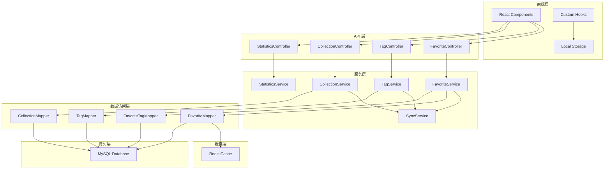

# 设计文档：收藏功能增强

## 概述

本设计文档描述了 Polaris Tools 平台收藏功能增强的技术实现方案。基于现有的 Spring Boot + MyBatis Plus + Redis 架构，我们将扩展收藏系统以支持批量操作、标签管理、分类组织、搜索筛选、统计分析和社交分享功能。

设计目标：
- 保持与现有架构的一致性
- 确保高性能和可扩展性
- 提供良好的用户体验
- 支持离线操作和数据同步
- 实现数据一致性和完整性

## 架构设计

### 系统架构



### 分层职责

**前端层：**
- React 组件负责 UI 渲染和用户交互
- Custom Hooks 封装业务逻辑和状态管理
- Local Storage 支持离线操作和数据缓存

**API 层：**
- RESTful API 端点
- 请求验证和参数解析
- 统一的响应格式和错误处理

**服务层：**
- 业务逻辑实现
- 事务管理
- 缓存策略
- 数据同步协调

**数据访问层：**
- MyBatis Plus Mapper 接口
- SQL 查询优化
- 数据库操作封装

**缓存层：**
- Redis 缓存热点数据
- 缓存失效策略
- 分布式锁支持

**持久层：**
- MySQL 数据存储
- 索引优化
- 事务支持

## 组件和接口

### 后端组件

#### 1. 扩展的 FavoriteController

```java
@RestController
@RequestMapping("/api/v1/favorites")
public class FavoriteController {
    
    // 现有接口保持不变
    // GET /api/v1/favorites - 获取收藏列表
    // POST /api/v1/favorites - 添加收藏
    // DELETE /api/v1/favorites/{toolId} - 删除收藏
    // GET /api/v1/favorites/check/{toolId} - 检查收藏状态
    
    // 新增接口
    
    /**
     * 批量添加收藏
     * POST /api/v1/favorites/batch
     * Body: { "toolIds": [1, 2, 3] }
     * Response: { "success": [1, 2], "failed": [{"toolId": 3, "reason": "Already exists"}] }
     */
    @PostMapping("/batch")
    public ResponseEntity<BatchOperationResult> batchAddFav