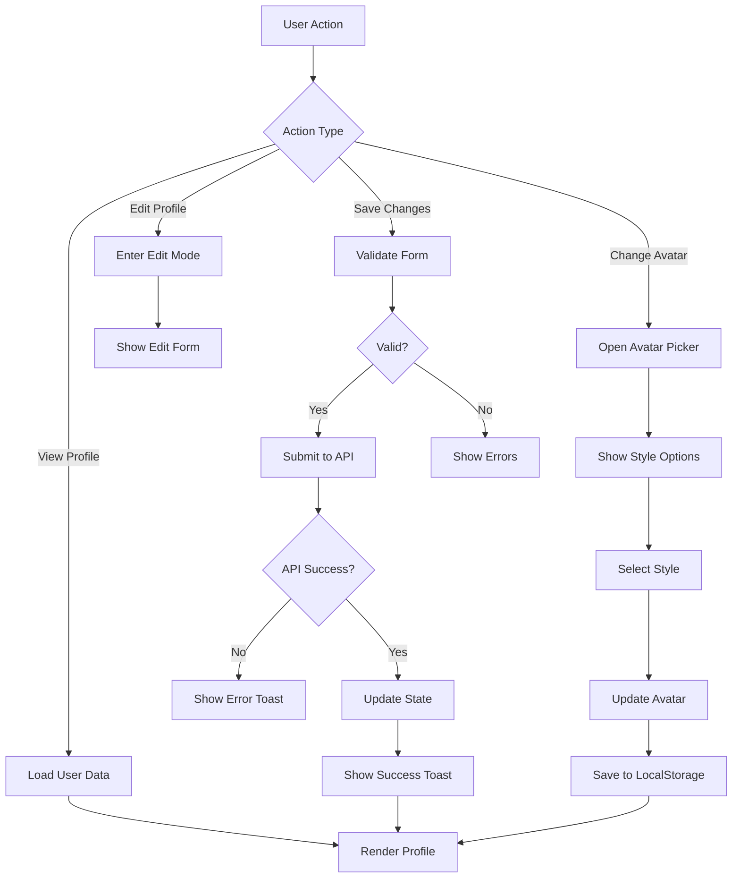

# Design Document: User Profile Page

## Overview

本设计文档描述了 Polaris Tools 平台用户资料页面的技术实现方案。该功能基于 React + TypeScript 技术栈，使用 DiceBear 库生成确定性头像，提供完整的用户信息查看和编辑功能。

设计目标：
- 提供直观的用户资料查看和编辑界面
- 集成 DiceBear 头像生成系统，支持多种风格选择
- 实现响应式设计，支持深色模式
- 确保数据持久化和状态同步
- 优化性能，避免不必要的重新渲染

## Architecture

### 系统架构

```
┌─────────────────────────────────────────────────────────────┐
│                      Profile Page (React)                    │
├─────────────────────────────────────────────────────────────┤
│                                                               │
│  ┌──────────────┐  ┌──────────────┐  ┌──────────────┐      │
│  │   Header     │  │   Avatar     │  │   Info       │      │
│  │   Section    │  │   Section    │  │   Section    │      │
│  └──────────────┘  └──────────────┘  └──────────────┘      │
│                                                               │
│  ┌──────────────────────────────────────────────────────┐   │
│  │          Avatar Style Picker (Modal)                  │   │
│  └──────────────────────────────────────────────────────┘   │
│                                                               │
├─────────────────────────────────────────────────────────────┤
│                    State Management                          │
│  ┌──────────────┐  ┌──────────────┐  ┌──────────────┐      │
│  │  Edit Mode   │  │  Form Data   │  │  Avatar      │      │
│  │  State       │  │  State       │  │  State       │      │
│  └──────────────┘  └──────────────┘  └──────────────┘      │
├─────────────────────────────────────────────────────────────┤
│                    External Services                         │
│  ┌──────────────┐  ┌──────────────┐  ┌──────────────┐      │
│  │  DiceBear    │  │  Backend     │  │  Local       │      │
│  │  Library     │  │  API         │  │  Storage     │      │
│  └──────────────┘  └──────────────┘  └──────────────┘      │
└─────────────────────────────────────────────────────────────┘
```

### 数据流



## Components and Interfaces

### 1. Profile Component (主组件)

**职责**：
- 管理页面整体状态
- 协调子组件交互
- 处理数据获取和提交

**Props**：无（从 AppContext 获取数据）

**State**：
```typescript
interface ProfileState {
  isEditing: boolean;              // 是否处于编辑模式
  showAvatarPicker: boolean;       // 是否显示头像选择器
  selectedAvatarStyle: string;     // 当前选择的头像风格
  editForm: {
    nickname: string;
    email: string;
    bio: string;
  };
  errors: {
    nickname?: string;
    email?: string;
    bio?: string;
  };
  isSubmitting: boolean;           // 是否正在提交
}
```

### 2. AvatarSection Component

**职责**：
- 显示用户头像
- 处理头像点击事件
- 显示在线状态

**Props**：
```typescript
interface AvatarSectionProps {
  avatarDataUri: string;           // 头像 Data URI
  isOnline: boolean;               // 在线状态
  onClick: () => void;             // 点击事件
}
```

### 3. AvatarStylePicker Component

**职责**：
- 显示所有可用的头像风格
- 处理风格选择
- 提供预览功能

**Props**：
```typescript
interface AvatarStylePickerProps {
  isOpen: boolean;                 // 是否显示
  currentStyle: string;            // 当前风格
  username: string;                // 用户名（用于生成预览）
  onSelect: (styleId: string) => void;  // 选择回调
  onClose: () => void;             // 关闭回调
}
```

### 4. ProfileInfoSection Component

**职责**：
- 显示用户信息（查看模式）
- 显示编辑表单（编辑模式）
- 处理表单验证

**Props**：
```typescript
interface ProfileInfoSectionProps {
  user: UserResponse;
  isEditing: boolean;
  editForm: EditFormData;
  errors: FormErrors;
  onFormChange: (field: string, value: string) => void;
  onSave: () => void;
  onCancel: () => void;
  onEdit: () => void;
}
```

### 5. PlanBadge Component

**职责**：
- 显示用户计划类型徽章
- 根据计划类型应用不同样式

**Props**：
```typescript
interface PlanBadgeProps {
  planType: number;                // 计划类型代码
}
```

## Data Models

### UserResponse (现有类型)

```typescript
interface UserResponse {
  id: number;
  username: string;
  nickname?: string;
  email: string;
  planType: number;              // 0=免费, 1=专业, 2=企业, 999=管理员
  avatar?: string;               // 头像 seed（可选）
  bio?: string;                  // 个人简介（可选）
  createdAt: string;
  updatedAt: string;
}
```

### AvatarStyle (新类型)

```typescript
interface AvatarStyle {
  id: string;                    // 风格 ID（如 'lorelei'）
  name: string;                  // 显示名称
  style: StyleFunction;          // DiceBear 风格函数
  description: string;           // 风格描述
}
```

### EditFormData (新类型)

```typescript
interface EditFormData {
  nickname: string;
  email: string;
  bio: string;
}
```

### FormErrors (新类型)

```typescript
interface FormErrors {
  nickname?: string;
  email?: string;
  bio?: string;
}
```

### UpdateProfileRequest (新类型)

```typescript
interface UpdateProfileRequest {
  nickname?: string;
  email?: string;
  bio?: string;
  avatarStyle?: string;          // 头像风格偏好
}
```

## Implementation Details

### 头像生成逻辑

```typescript
// 使用 useMemo 缓存头像生成结果
const avatarSvg = useMemo(() => {
  if (!user) return '';
  
  // 获取风格函数
  const styleConfig = AVATAR_STYLES.find(s => s.id === selectedAvatarStyle);
  const styleFunction = styleConfig?.style || lorelei;
  
  // 使用用户名或自定义 seed
  const seed = user.avatar || user.username;
  
  // 生成头像
  const avatar = createAvatar(styleFunction, {
    seed,
    size: 128,
  });
  
  return avatar.toString();
}, [user, selectedAvatarStyle]);

// 转换为 Data URI
const avatarDataUri = useMemo(() => {
  if (!avatarSvg) return '';
  return `data:image/svg+xml;base64,${btoa(avatarSvg)}`;
}, [avatarSvg]);
```

### 表单验证逻辑

```typescript
const validateForm = (formData: EditFormData): FormErrors => {
  const errors: FormErrors = {};
  
  // 验证昵称
  if (formData.nickname && formData.nickname.length > 50) {
    errors.nickname = '昵称不能超过 50 个字符';
  }
  
  // 验证邮箱
  const emailRegex = /^[^\s@]+@[^\s@]+\.[^\s@]+$/;
  if (formData.email && !emailRegex.test(formData.email)) {
    errors.email = '请输入有效的邮箱地址';
  }
  
  // 验证简介
  if (formData.bio && formData.bio.length > 200) {
    errors.bio = '个人简介不能超过 200 个字符';
  }
  
  return errors;
};
```

### 数据持久化

**LocalStorage（头像风格偏好）**：
```typescript
// 保存头像风格
const saveAvatarStyle = (styleId: string) => {
  localStorage.setItem('avatarStyle', styleId);
  setSelectedAvatarStyle(styleId);
};

// 加载头像风格
useEffect(() => {
  const savedStyle = localStorage.getItem('avatarStyle');
  if (savedStyle && AVATAR_STYLES.some(s => s.id === savedStyle)) {
    setSelectedAvatarStyle(savedStyle);
  }
}, []);
```

**Backend API（用户信息）**：
```typescript
// 更新用户资料
const handleSaveProfile = async () => {
  try {
    setIsSubmitting(true);
    
    // 验证表单
    const errors = validateForm(editForm);
    if (Object.keys(errors).length > 0) {
      setErrors(errors);
      return;
    }
    
    // 提交到后端
    const response = await apiClient.user.updateProfile({
      nickname: editForm.nickname,
      email: editForm.email,
      bio: editForm.bio,
      avatarStyle: selectedAvatarStyle,
    });
    
    // 更新本地状态
    await refreshUser();
    
    // 显示成功消息
    showToast('个人资料已更新', 'success');
    setIsEditing(false);
    setErrors({});
  } catch (error) {
    showToast('更新失败，请重试', 'error');
    console.error('Profile update error:', error);
  } finally {
    setIsSubmitting(false);
  }
};
```

### 响应式设计

使用 Tailwind CSS 的响应式类：

```typescript
// 容器
<div className="max-w-5xl mx-auto p-6 md:p-8 lg:p-10">

// 头像尺寸
<div className="size-16 md:size-20 lg:size-24">

// 网格布局
<div className="grid grid-cols-1 md:grid-cols-2 lg:grid-cols-3 gap-4">

// 文本大小
<h1 className="text-xl md:text-2xl lg:text-3xl">
```

### 深色模式支持

使用 Tailwind 的 dark: 前缀：

```typescript
// 背景色
className="bg-white dark:bg-surface-dark"

// 文本色
className="text-slate-900 dark:text-white"

// 边框色
className="border-slate-200 dark:border-border-dark"

// 按钮样式
className="bg-slate-900 dark:bg-white text-white dark:text-slate-900"
```

### 性能优化

1. **使用 useMemo 缓存计算结果**：
```typescript
const avatarSvg = useMemo(() => {
  // 头像生成逻辑
}, [user, selectedAvatarStyle]);

const planDisplay = useMemo(() => {
  // 计划类型显示逻辑
}, [user?.planType]);
```

2. **使用 useCallback 缓存回调函数**：
```typescript
const handleFormChange = useCallback((field: string, value: string) => {
  setEditForm(prev => ({ ...prev, [field]: value }));
}, []);

const handleAvatarStyleChange = useCallback((styleId: string) => {
  saveAvatarStyle(styleId);
  setShowAvatarPicker(false);
}, []);
```

3. **条件渲染优化**：
```typescript
// 只在需要时渲染头像选择器
{showAvatarPicker && (
  <AvatarStylePicker
    isOpen={showAvatarPicker}
    currentStyle={selectedAvatarStyle}
    username={user.username}
    onSelect={handleAvatarStyleChange}
    onClose={() => setShowAvatarPicker(false)}
  />
)}
```

## API Endpoints

### 获取当前用户信息

**Endpoint**: `GET /api/auth/me`

**Response**:
```typescript
{
  success: true,
  data: UserResponse
}
```

### 更新用户资料

**Endpoint**: `PUT /api/user/profile`

**Request Body**:
```typescript
{
  nickname?: string;
  email?: string;
  bio?: string;
  avatarStyle?: string;
}
```

**Response**:
```typescript
{
  success: true,
  data: UserResponse,
  message: "Profile updated successfully"
}
```

**Error Response**:
```typescript
{
  success: false,
  message: "Validation error",
  errors: {
    email?: string;
    nickname?: string;
    bio?: string;
  }
}
```

## Correctness Properties

*属性（Property）是一种特征或行为，应该在系统的所有有效执行中保持为真——本质上是关于系统应该做什么的正式陈述。属性是人类可读规范和机器可验证正确性保证之间的桥梁。*

### Property 1: 头像确定性

*对于任意*用户名和头像风格组合，多次生成头像应该产生完全相同的 SVG 输出

**Validates: Requirements 1.3**

### Property 2: 头像风格持久化

*对于任意*头像风格选择，保存到 LocalStorage 后重新加载页面应该恢复相同的风格设置

**Validates: Requirements 2.5, 2.6**

### Property 3: 邮箱验证一致性

*对于任意*邮箱字符串，如果它不匹配标准邮箱格式（包含 @ 和域名），验证函数应该返回错误

**Validates: Requirements 5.1, 5.2**

### Property 4: 字段长度验证

*对于任意*表单字段（昵称、简介），如果输入长度超过定义的最大值（昵称 50 字符，简介 200 字符），验证函数应该返回相应的错误消息

**Validates: Requirements 5.3, 5.4, 5.5, 5.6**

### Property 5: 表单提交前置条件

*对于任意*表单数据，只有当所有字段验证都通过时（errors 对象为空），系统才应该允许提交到后端 API

**Validates: Requirements 5.7**

### Property 6: 数据同步一致性

*对于任意*成功的 API 更新响应，本地用户状态应该与服务器返回的数据保持一致

**Validates: Requirements 6.2, 6.3**

### Property 7: 编辑模式状态隔离

*对于任意*编辑操作，点击"取消"按钮应该丢弃所有未保存的更改，恢复到编辑前的状态

**Validates: Requirements 4.7**

### Property 8: 头像预览实时性

*对于任意*头像风格选择，在选择器中切换风格时应该立即显示该风格的预览效果

**Validates: Requirements 2.4**

### Property 9: 响应式布局适配

*对于任意*屏幕宽度，页面布局应该根据断点（mobile < 768px, tablet < 1024px, desktop >= 1024px）应用相应的样式类

**Validates: Requirements 7.1, 7.2, 7.3**

### Property 10: 深色模式样式完整性

*对于任意*UI 元素，在深色模式和浅色模式之间切换时，所有元素都应该有对应的样式定义（无未定义的样式）

**Validates: Requirements 8.1, 8.2, 8.3**

## Error Handling

### 1. 用户未登录

**场景**：用户未登录时访问资料页面

**处理**：
```typescript
if (!user) {
  return (
    <main className="flex-1 overflow-y-auto p-6">
      <div className="max-w-5xl mx-auto text-center py-20">
        <Icon name="person_off" className="text-6xl text-slate-400 mb-4" />
        <p className="text-slate-500 dark:text-text-secondary">
          请先登录查看个人资料
        </p>
      </div>
    </main>
  );
}
```

**Validates: Requirements 10.1**

### 2. API 请求失败

**场景**：更新用户资料时 API 返回错误

**处理**：
```typescript
try {
  await apiClient.user.updateProfile(data);
  showToast('个人资料已更新', 'success');
} catch (error) {
  if (error.response?.status === 400) {
    // 验证错误
    const apiErrors = error.response.data.errors;
    setErrors(apiErrors);
    showToast('请检查输入的信息', 'error');
  } else if (error.response?.status === 401) {
    // 未授权
    showToast('登录已过期，请重新登录', 'error');
    logout();
  } else {
    // 其他错误
    showToast('更新失败，请重试', 'error');
  }
  console.error('Profile update error:', error);
}
```

**Validates: Requirements 10.2**

### 3. 网络连接失败

**场景**：网络不可用或请求超时

**处理**：
```typescript
try {
  await apiClient.user.updateProfile(data);
} catch (error) {
  if (error.code === 'ECONNABORTED' || error.message === 'Network Error') {
    showToast('网络连接失败，请检查您的网络', 'error');
  } else {
    showToast('更新失败，请重试', 'error');
  }
}
```

**Validates: Requirements 10.3**

### 4. 表单验证错误

**场景**：用户输入不符合验证规则

**处理**：
```typescript
const errors = validateForm(editForm);
if (Object.keys(errors).length > 0) {
  setErrors(errors);
  // 在表单字段旁显示错误消息
  return;
}
```

**UI 显示**：
```typescript
{errors.email && (
  <p className="text-sm text-red-600 dark:text-red-400 mt-1">
    {errors.email}
  </p>
)}
```

**Validates: Requirements 10.4**

### 5. DiceBear 头像生成失败

**场景**：头像生成过程中出现异常

**处理**：
```typescript
const avatarSvg = useMemo(() => {
  try {
    if (!user) return '';
    
    const styleConfig = AVATAR_STYLES.find(s => s.id === selectedAvatarStyle);
    const styleFunction = styleConfig?.style || lorelei;
    const seed = user.avatar || user.username;
    
    const avatar = createAvatar(styleFunction, {
      seed,
      size: 128,
    });
    
    return avatar.toString();
  } catch (error) {
    console.error('Avatar generation error:', error);
    // 返回默认占位符 SVG
    return '<svg>...</svg>'; // 简单的占位符
  }
}, [user, selectedAvatarStyle]);
```

**Validates: Requirements 10.5**

### 6. 错误日志记录

**场景**：所有错误都应该被记录

**处理**：
```typescript
// 在所有 catch 块中
console.error('Error context:', error);

// 对于关键错误，可以添加更详细的日志
console.error('Profile update failed:', {
  user: user?.username,
  timestamp: new Date().toISOString(),
  error: error.message,
  stack: error.stack,
});
```

**Validates: Requirements 10.6**

## Testing Strategy

### 单元测试（Unit Tests）

单元测试用于验证特定示例、边缘情况和错误条件。

#### 1. 表单验证函数测试

```typescript
describe('validateForm', () => {
  test('应该接受有效的邮箱地址', () => {
    const errors = validateForm({
      nickname: 'Test User',
      email: 'test@example.com',
      bio: 'Hello world',
    });
    expect(errors.email).toBeUndefined();
  });
  
  test('应该拒绝无效的邮箱地址', () => {
    const errors = validateForm({
      nickname: 'Test User',
      email: 'invalid-email',
      bio: 'Hello world',
    });
    expect(errors.email).toBeDefined();
  });
  
  test('应该拒绝超长的昵称', () => {
    const errors = validateForm({
      nickname: 'a'.repeat(51),
      email: 'test@example.com',
      bio: 'Hello',
    });
    expect(errors.nickname).toBeDefined();
  });
  
  test('应该拒绝超长的简介', () => {
    const errors = validateForm({
      nickname: 'Test',
      email: 'test@example.com',
      bio: 'a'.repeat(201),
    });
    expect(errors.bio).toBeDefined();
  });
});
```

#### 2. 头像生成测试

```typescript
describe('Avatar Generation', () => {
  test('应该为相同的用户名和风格生成相同的头像', () => {
    const avatar1 = generateAvatar('testuser', 'lorelei');
    const avatar2 = generateAvatar('testuser', 'lorelei');
    expect(avatar1).toBe(avatar2);
  });
  
  test('应该为不同的用户名生成不同的头像', () => {
    const avatar1 = generateAvatar('user1', 'lorelei');
    const avatar2 = generateAvatar('user2', 'lorelei');
    expect(avatar1).not.toBe(avatar2);
  });
  
  test('应该处理头像生成错误', () => {
    // 模拟 DiceBear 抛出错误
    const avatar = generateAvatarWithErrorHandling(null, 'lorelei');
    expect(avatar).toBeTruthy(); // 应该返回占位符
  });
});
```

#### 3. 组件渲染测试

```typescript
describe('Profile Component', () => {
  test('未登录时应该显示提示信息', () => {
    render(<Profile />, { user: null });
    expect(screen.getByText('请先登录查看个人资料')).toBeInTheDocument();
  });
  
  test('应该显示用户信息', () => {
    const mockUser = {
      username: 'testuser',
      nickname: 'Test User',
      email: 'test@example.com',
      planType: 1,
    };
    render(<Profile />, { user: mockUser });
    expect(screen.getByText('Test User')).toBeInTheDocument();
    expect(screen.getByText('@testuser')).toBeInTheDocument();
  });
  
  test('点击编辑按钮应该进入编辑模式', () => {
    render(<Profile />, { user: mockUser });
    fireEvent.click(screen.getByText('编辑资料'));
    expect(screen.getByText('保存')).toBeInTheDocument();
    expect(screen.getByText('取消')).toBeInTheDocument();
  });
});
```

### 属性测试（Property-Based Tests）

属性测试用于验证跨所有输入的通用属性。每个属性测试应该运行至少 100 次迭代。

#### 1. 头像确定性属性测试

```typescript
import { fc } from 'fast-check';

describe('Property: Avatar Determinism', () => {
  test('相同的用户名和风格应该总是生成相同的头像', () => {
    // Feature: user-profile-page, Property 1: 头像确定性
    fc.assert(
      fc.property(
        fc.string({ minLength: 1, maxLength: 50 }), // 用户名
        fc.constantFrom('lorelei', 'avataaars', 'bottts', 'pixelArt'), // 风格
        (username, style) => {
          const avatar1 = generateAvatar(username, style);
          const avatar2 = generateAvatar(username, style);
          return avatar1 === avatar2;
        }
      ),
      { numRuns: 100 }
    );
  });
});
```

#### 2. 邮箱验证属性测试

```typescript
describe('Property: Email Validation', () => {
  test('所有不包含@符号的字符串应该被拒绝', () => {
    // Feature: user-profile-page, Property 3: 邮箱验证一致性
    fc.assert(
      fc.property(
        fc.string().filter(s => !s.includes('@')),
        (invalidEmail) => {
          const errors = validateForm({
            nickname: 'Test',
            email: invalidEmail,
            bio: 'Bio',
          });
          return errors.email !== undefined;
        }
      ),
      { numRuns: 100 }
    );
  });
  
  test('所有符合邮箱格式的字符串应该被接受', () => {
    // Feature: user-profile-page, Property 3: 邮箱验证一致性
    fc.assert(
      fc.property(
        fc.emailAddress(),
        (validEmail) => {
          const errors = validateForm({
            nickname: 'Test',
            email: validEmail,
            bio: 'Bio',
          });
          return errors.email === undefined;
        }
      ),
      { numRuns: 100 }
    );
  });
});
```

#### 3. 字段长度验证属性测试

```typescript
describe('Property: Field Length Validation', () => {
  test('所有超过50字符的昵称应该被拒绝', () => {
    // Feature: user-profile-page, Property 4: 字段长度验证
    fc.assert(
      fc.property(
        fc.string({ minLength: 51, maxLength: 100 }),
        (longNickname) => {
          const errors = validateForm({
            nickname: longNickname,
            email: 'test@example.com',
            bio: 'Bio',
          });
          return errors.nickname !== undefined;
        }
      ),
      { numRuns: 100 }
    );
  });
  
  test('所有超过200字符的简介应该被拒绝', () => {
    // Feature: user-profile-page, Property 4: 字段长度验证
    fc.assert(
      fc.property(
        fc.string({ minLength: 201, maxLength: 300 }),
        (longBio) => {
          const errors = validateForm({
            nickname: 'Test',
            email: 'test@example.com',
            bio: longBio,
          });
          return errors.bio !== undefined;
        }
      ),
      { numRuns: 100 }
    );
  });
});
```

#### 4. 头像风格持久化属性测试

```typescript
describe('Property: Avatar Style Persistence', () => {
  test('保存到LocalStorage的风格应该能够被正确恢复', () => {
    // Feature: user-profile-page, Property 2: 头像风格持久化
    fc.assert(
      fc.property(
        fc.constantFrom('lorelei', 'avataaars', 'bottts', 'pixelArt', 'thumbs', 'funEmoji', 'bigSmile', 'initials'),
        (style) => {
          // 保存风格
          localStorage.setItem('avatarStyle', style);
          
          // 读取风格
          const savedStyle = localStorage.getItem('avatarStyle');
          
          // 清理
          localStorage.removeItem('avatarStyle');
          
          return savedStyle === style;
        }
      ),
      { numRuns: 100 }
    );
  });
});
```

#### 5. 编辑模式取消操作属性测试

```typescript
describe('Property: Edit Mode Cancellation', () => {
  test('取消编辑应该恢复原始数据', () => {
    // Feature: user-profile-page, Property 7: 编辑模式状态隔离
    fc.assert(
      fc.property(
        fc.record({
          nickname: fc.string({ maxLength: 50 }),
          email: fc.emailAddress(),
          bio: fc.string({ maxLength: 200 }),
        }),
        fc.record({
          nickname: fc.string({ maxLength: 50 }),
          email: fc.emailAddress(),
          bio: fc.string({ maxLength: 200 }),
        }),
        (originalData, editedData) => {
          // 模拟编辑流程
          let currentData = { ...originalData };
          
          // 进入编辑模式并修改
          currentData = { ...editedData };
          
          // 取消编辑
          currentData = { ...originalData };
          
          // 验证数据恢复
          return JSON.stringify(currentData) === JSON.stringify(originalData);
        }
      ),
      { numRuns: 100 }
    );
  });
});
```

### 集成测试（Integration Tests）

```typescript
describe('Profile Page Integration', () => {
  test('完整的编辑流程', async () => {
    // 1. 渲染页面
    render(<Profile />, { user: mockUser });
    
    // 2. 进入编辑模式
    fireEvent.click(screen.getByText('编辑资料'));
    
    // 3. 修改表单
    fireEvent.change(screen.getByLabelText('昵称'), {
      target: { value: 'New Nickname' },
    });
    
    // 4. 保存
    fireEvent.click(screen.getByText('保存'));
    
    // 5. 验证 API 调用
    await waitFor(() => {
      expect(mockApiClient.user.updateProfile).toHaveBeenCalledWith({
        nickname: 'New Nickname',
        email: mockUser.email,
        bio: '',
        avatarStyle: 'lorelei',
      });
    });
    
    // 6. 验证成功提示
    expect(screen.getByText('个人资料已更新')).toBeInTheDocument();
  });
  
  test('头像风格选择流程', async () => {
    render(<Profile />, { user: mockUser });
    
    // 1. 点击头像
    fireEvent.click(screen.getByAltText('Avatar'));
    
    // 2. 选择器应该打开
    expect(screen.getByText('选择头像风格')).toBeInTheDocument();
    
    // 3. 选择新风格
    fireEvent.click(screen.getByText('Avataaars'));
    
    // 4. 验证 LocalStorage
    expect(localStorage.getItem('avatarStyle')).toBe('avataaars');
    
    // 5. 选择器应该关闭
    expect(screen.queryByText('选择头像风格')).not.toBeInTheDocument();
  });
});
```

### 测试配置

**测试框架**：Jest + React Testing Library + fast-check

**配置文件** (`jest.config.js`):
```javascript
module.exports = {
  testEnvironment: 'jsdom',
  setupFilesAfterEnv: ['<rootDir>/src/setupTests.ts'],
  moduleNameMapper: {
    '\\.(css|less|scss|sass)$': 'identity-obj-proxy',
  },
  collectCoverageFrom: [
    'src/**/*.{ts,tsx}',
    '!src/**/*.d.ts',
    '!src/index.tsx',
  ],
  coverageThresholds: {
    global: {
      branches: 80,
      functions: 80,
      lines: 80,
      statements: 80,
    },
  },
};
```

**运行测试**：
```bash
# 运行所有测试
npm test

# 运行属性测试
npm test -- --testNamePattern="Property"

# 运行单元测试
npm test -- --testNamePattern="Unit"

# 生成覆盖率报告
npm test -- --coverage
```
